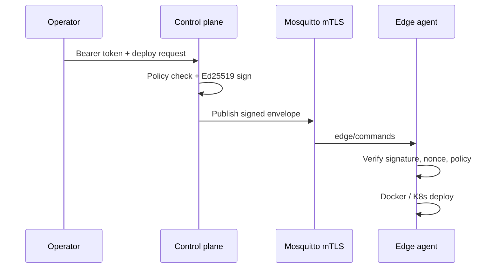

# Architecture

Edge Deployment Manager is a **control plane + edge agent** system for signed, policy-bound deployments over MQTT.

## Components

| Component | Role |
|-----------|------|
| **Control plane** | Device registry, policy, signed command issuance, bootstrap, audit |
| **Mosquitto** | mTLS MQTT bus (`edge/commands`, status topics) |
| **Edge agent** | Verifies signed commands, runs Docker/K8s deploy actions |
| **PostgreSQL** (HA) | Shared device registry |
| **Redis** (optional) | Shared command nonce replay store for scaled agents |

## Trust model

- Operators authenticate to the API with `CONTROL_PLANE_API_TOKEN`.
- Commands are **Ed25519-signed**; agents trust configured issuer public keys.
- Agents connect to MQTT with **mTLS client certificates** issued at bootstrap.
- **Replay protection** uses durable nonce stores (SQLite per agent, or Redis when shared).

## HA control plane

- Multiple control plane Pods share **PostgreSQL**.
- **One leader** holds a Postgres advisory lock and is the only replica that publishes MQTT commands.
- Followers serve reads and return `503` on command publish.

## Deployment modes

| Mode | Command | Use case |
|------|---------|----------|
| Local prod stack | `make prod-up` | Developer laptop, full mTLS stack |
| HA stack | `make ha-up` | Two control planes + Postgres |
| Kubernetes | `helm install` chart under `deploy/helm/edge-stack` | Cluster deployment |

## Configuration boundaries

- **Control plane**: `configs/control-plane.yaml` or Helm ConfigMap
- **Edge agent**: `configs/config.yaml` or enrollment output / Helm ConfigMap
- **Secrets**: environment, `*_FILE`, or `/run/secrets` mounts (`SecretProvider`)

See also: [PRODUCTION_ROADMAP.md](PRODUCTION_ROADMAP.md)
