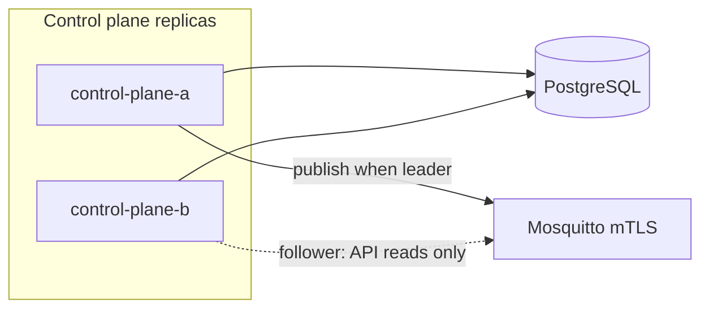

# HA control plane (Phase 2)

Run multiple control plane replicas with a **shared PostgreSQL registry** and **single active leader** for MQTT command publishing.

## Architecture



- **Registry writes/reads**: all replicas use Postgres (`registry.backend: postgres`).
- **Command publish**: only the leader holds `pg_advisory_lock` and may call `issue_command`.
- **Followers**: return `503` on `POST .../commands` with `this replica is not the active leader`.

## Configuration

```yaml
ha:
  enabled: true
  leader_lock_key: 84001
  holder_id_env: HOSTNAME
  poll_interval_seconds: 2

registry:
  backend: postgres
  url_env: CONTROL_PLANE_DATABASE_URL
```

Install driver: `pip install 'edge-deployment-manager[postgres]'`

## Local HA stack

```bash
make setup-dev
make ha-up
```

Endpoints:

| Replica | URL |
|---------|-----|
| A | https://localhost:8080 |
| B | https://localhost:8081 |

Check leadership:

```bash
curl -sk -H "Authorization: Bearer $TOKEN" https://localhost:8080/v1/leader
curl -sk -H "Authorization: Bearer $TOKEN" https://localhost:8081/v1/leader
```

Exactly one replica should report `"is_leader": true`.

## MQTT credentials (shared)

Mount the same control plane MQTT client certificate on every replica:

```yaml
mqtt:
  tls:
    cert_file: certs/control-plane-mqtt.crt
    key_file: certs/control-plane-mqtt.key
```

In Kubernetes, reference the same Secret volume on each Pod (see Helm `controlPlane.mqtt.existingSecret`).

## Failover

When the leader stops, its Postgres session ends and the advisory lock is released. Another replica acquires leadership within `poll_interval_seconds` (default 2s).

## API

| Method | Path | Notes |
|--------|------|-------|
| GET | `/v1/leader` | Leadership status (authenticated) |
| GET | `/ready` | Includes `is_leader` and `leader_holder` when HA enabled |
